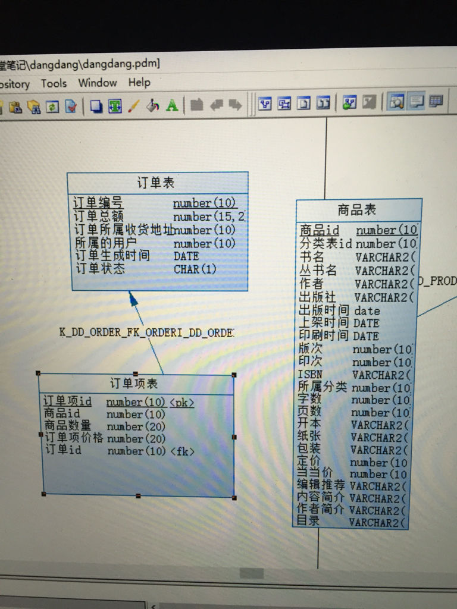

# 拓胜科技后端工程师上机考试试题
## 以下试题根据自己的应聘职位的等级自行选择一题作答即可。
* 任务1（初、中级）：使用Springmvc+Mybatis的架构完成订单管理基本的CRUD功能。
      ** 手脚架：https://github.com/narci2010/springmvc-mybatis
* 下图是订单和订单项表结构（请忽略商品表）：
      
       
1. 实现订单项CRUD操作：
    显示订单号为1的订单详情：/order/1
     显示订单号为1的订单详情：/orde
    2. 如果将数据存放到服务器端，REST发布服务，在代码中说明vue、angular2、react如何解决跨域访问问题（加分）。
   3. 如果将数据存放到服务器端，REST发布服务，如果客户与服务器端要保留cookie通信，在代码中说明vue、angular2、react如何处理（加分）。
